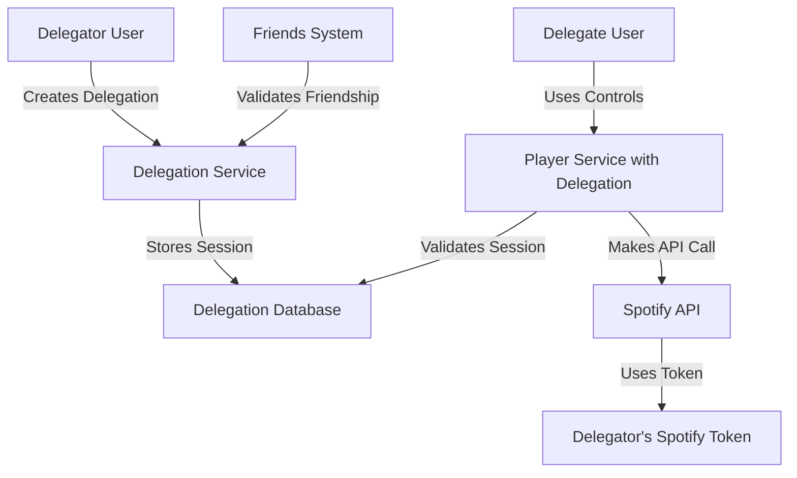

# Design Document

## Overview

The control delegation feature enables users to share their Spotify music controls with friends in the app. This is an MVP implementation focused on simplicity - friends can grant each other full music control access that remains active until manually revoked.

## Architecture

### High-Level Architecture



### System Components

1. **Delegation Management Service**: Handles creation, validation, and revocation of delegation sessions
2. **Enhanced Player Service**: Extended to support delegation-based API calls
3. **Simple Validation**: Basic session validation without expiration logic

## Components and Interfaces

### Database Schema Extensions

```sql
-- Delegation sessions table
CREATE TABLE delegation_sessions (
    id UUID PRIMARY KEY DEFAULT gen_random_uuid(),
    delegator_id UUID REFERENCES profiles(id) NOT NULL,
    delegate_id UUID REFERENCES profiles(id) NOT NULL,
    created_at TIMESTAMP WITH TIME ZONE DEFAULT NOW(),
    session_token TEXT UNIQUE NOT NULL,

    CONSTRAINT different_users CHECK (delegator_id != delegate_id),
    CONSTRAINT unique_delegation UNIQUE (delegator_id, delegate_id)
);
```

### Core Interfaces

```typescript
// Delegation types
interface DelegationSession {
  id: string;
  delegatorId: string;
  delegateId: string;
  createdAt: Date;
  sessionToken: string;
}

// Service interfaces
interface DelegationService {
  createDelegation(delegatorId: string, delegateId: string): Promise<DelegationSession>;
  revokeDelegation(sessionId: string, revokerId: string): Promise<void>;
  validateDelegation(sessionToken: string): Promise<DelegationSession | null>;
  getUserDelegations(userId: string, type: 'given' | 'received'): Promise<DelegationSession[]>;
}

interface EnhancedPlayerService {
  playTrack(uris: string[], delegationToken?: string): Promise<void>;
  pauseTrack(delegationToken?: string): Promise<void>;
  skipToNextTrack(delegationToken?: string): Promise<void>;
  getCurrentTrack(delegationToken?: string): Promise<SpotifyCurrentlyPlayingTrack>;
  setVolume(volume: number, delegationToken?: string): Promise<void>;
}
```

### API Endpoints

```typescript
// Delegation management endpoints
POST /functions/v1/delegations/create
POST /functions/v1/delegations/revoke
GET /functions/v1/delegations/my-delegations

// Enhanced player endpoints with delegation support
PUT /functions/v1/player/play?delegation_token=<token>
PUT /functions/v1/player/pause?delegation_token=<token>
POST /functions/v1/player/next?delegation_token=<token>
GET /functions/v1/player/currently-playing?delegation_token=<token>
PUT /functions/v1/player/volume?delegation_token=<token>
```

## Data Models

### Delegation Session Model

```typescript
class DelegationSessionModel {
  id: string;
  delegatorId: string;
  delegateId: string;
  createdAt: Date;
  sessionToken: string;

  // Methods
  generateSessionToken(): string;
  delete(): void;
  isValid(): boolean;
}
```

### Delegation Validation

```typescript
class DelegationValidator {
  static async validateSession(sessionToken: string): Promise<DelegationSession | null> {
    const session = await this.getSessionByToken(sessionToken);

    if (!session) {
      return null;
    }

    return session;
  }

  static async validateFriendship(delegatorId: string, delegateId: string): Promise<boolean> {
    // Check if users are friends using existing friends system
    return await FriendsService.areFriends(delegatorId, delegateId);
  }
}
```

## Error Handling

### Error Types

```typescript
enum DelegationErrorType {
  DELEGATION_NOT_FOUND = 'DELEGATION_NOT_FOUND',
  INVALID_TOKEN = 'INVALID_TOKEN',
  SPOTIFY_TOKEN_EXPIRED = 'SPOTIFY_TOKEN_EXPIRED',
  USER_NOT_FOUND = 'USER_NOT_FOUND',
  NOT_FRIENDS = 'NOT_FRIENDS',
  SELF_DELEGATION_DENIED = 'SELF_DELEGATION_DENIED',
  DELEGATION_ALREADY_EXISTS = 'DELEGATION_ALREADY_EXISTS'
}

class DelegationError extends Error {
  constructor(
    public type: DelegationErrorType,
    message: string,
    public details?: any
  ) {
    super(message);
    this.name = 'DelegationError';
  }
}
```

### Error Handling Strategy

1. **Graceful Degradation**: When delegation fails, fall back to user's own controls if available
2. **User-Friendly Messages**: Convert technical errors to actionable user messages
3. **Simple Retry**: Basic retry logic for transient failures

## Testing Strategy

### Unit Tests

1. **Delegation Service Tests**
   - Test delegation creation and revocation
   - Validate token generation and verification
   - Test friendship validation

2. **Enhanced Player Service Tests**
   - Test delegation token validation
   - Verify API call routing with delegation
   - Test error handling and fallbacks

3. **Validation Tests**
   - Test session validation logic
   - Test friendship checking

### Integration Tests

1. **End-to-End Delegation Flow**
   - Create delegation → Use controls → Revoke delegation
   - Test full music control functionality

2. **Spotify API Integration**
   - Test API calls with delegated tokens
   - Verify token refresh handling
   - Test all music control actions

3. **Database Operations**
   - Test session persistence and retrieval

### Security Tests

1. **Token Security**
   - Verify session token uniqueness and unpredictability
   - Test unauthorized access prevention

2. **Access Control**
   - Test unauthorized access attempts
   - Verify user isolation (delegates can't access other delegations)
   - Test friendship requirement enforcement

3. **Session Management**
   - Verify single active delegation per user pair
   - Test concurrent delegation handling

## Security Considerations

### Token Management
- Delegation session tokens are cryptographically secure and unique
- Tokens are stored hashed in the database
- Sessions remain active until manually revoked

### Access Control
- Only friends can create delegations with each other
- Strict validation of delegation sessions before API calls
- No self-delegation allowed
- Only one active delegation per user pair at a time

### Data Privacy
- Minimal data exposure to delegates
- No access to delegator's personal Spotify data beyond current playback
- Secure transmission of all delegation-related data

### Attack Prevention
- Protection against session hijacking
- Prevention of delegation token brute force attacks
- Rate limiting inherited from Spotify API limits
