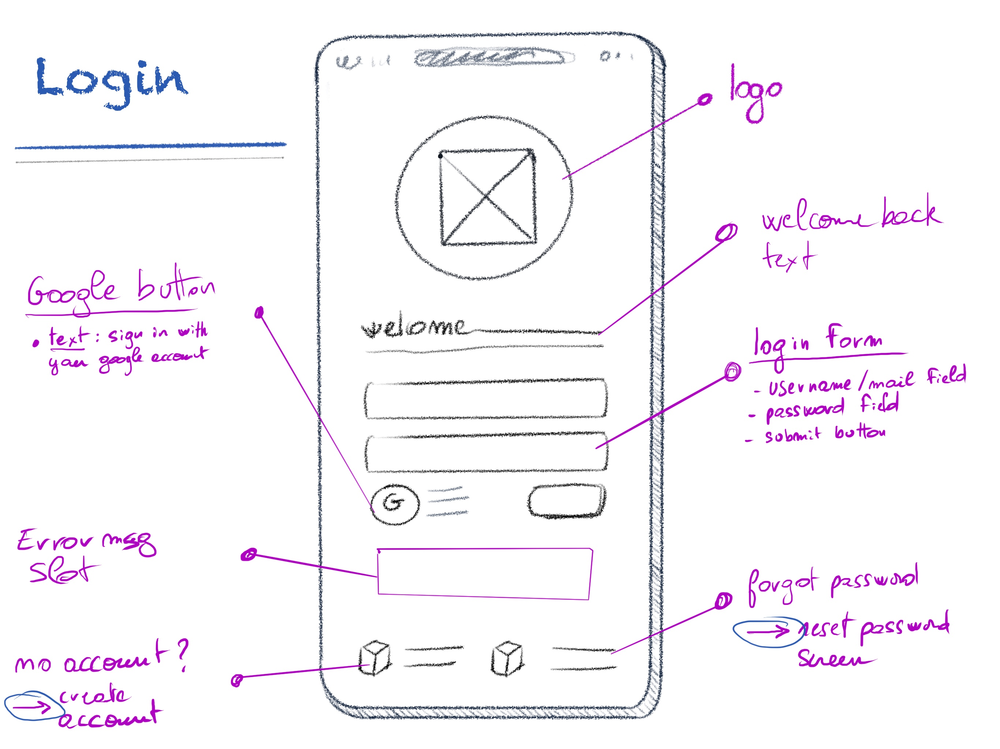
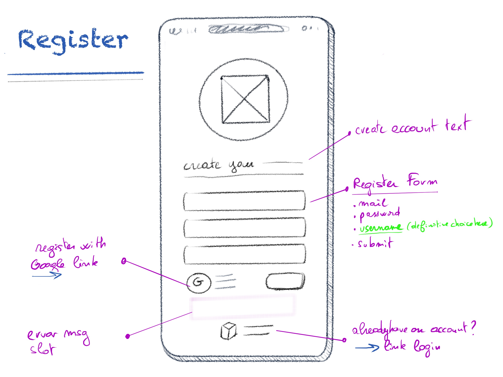
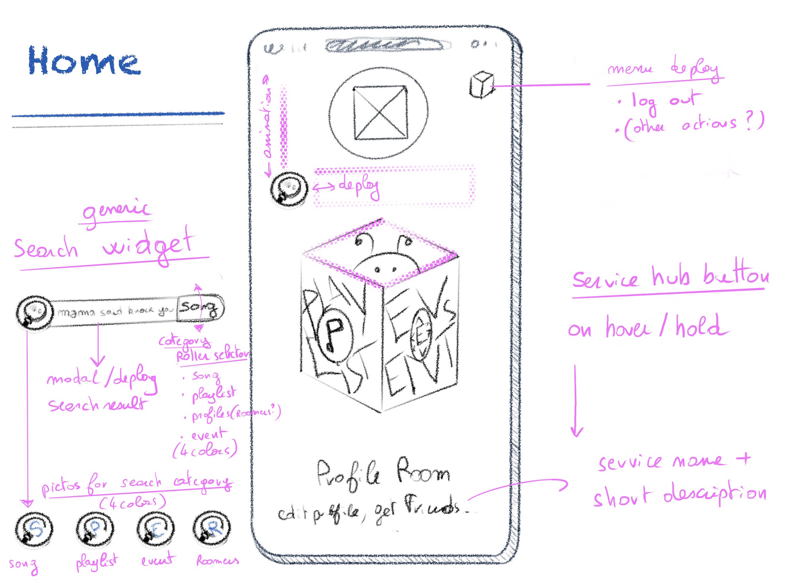
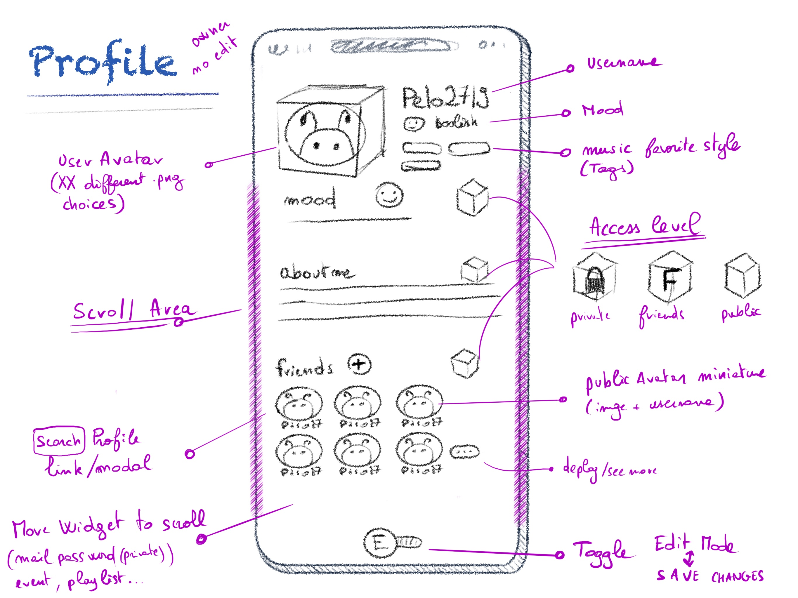
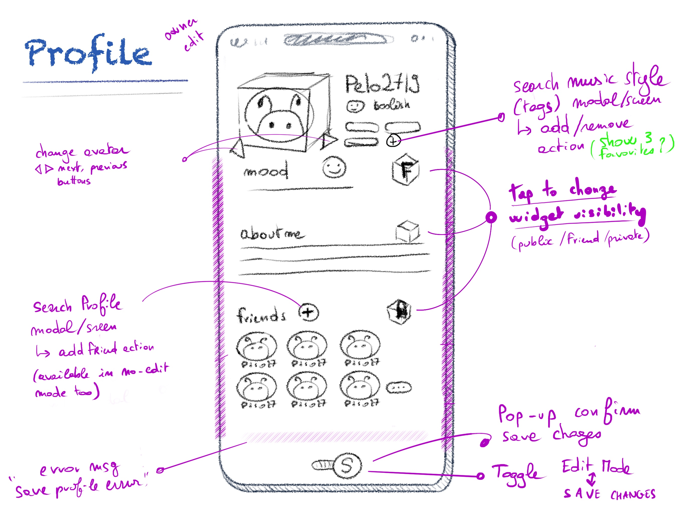
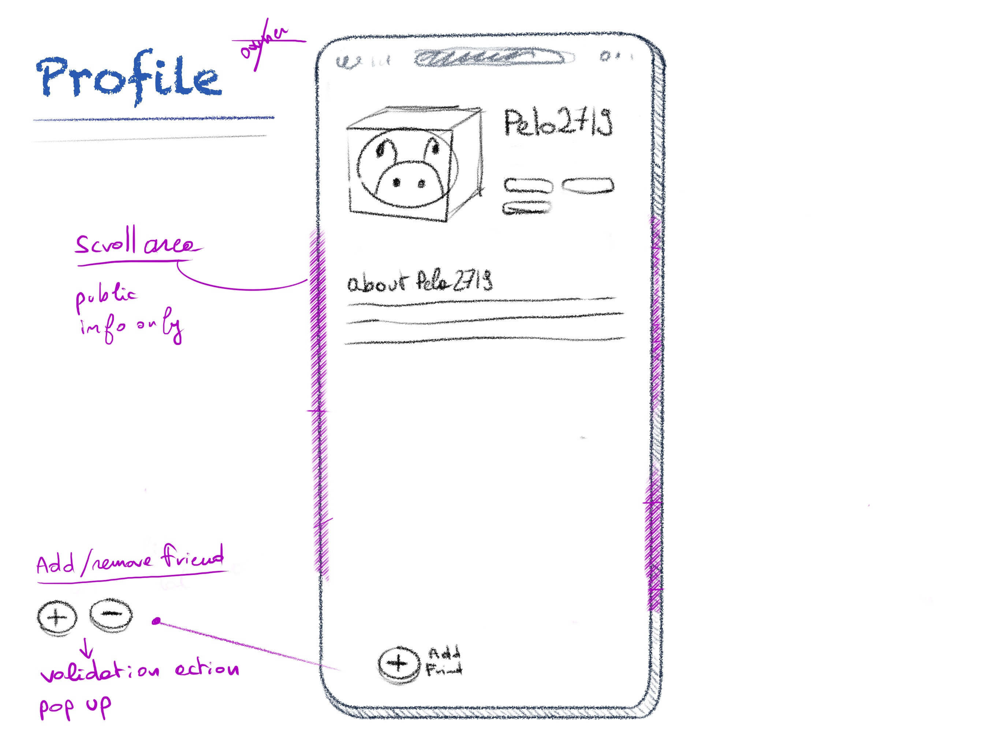
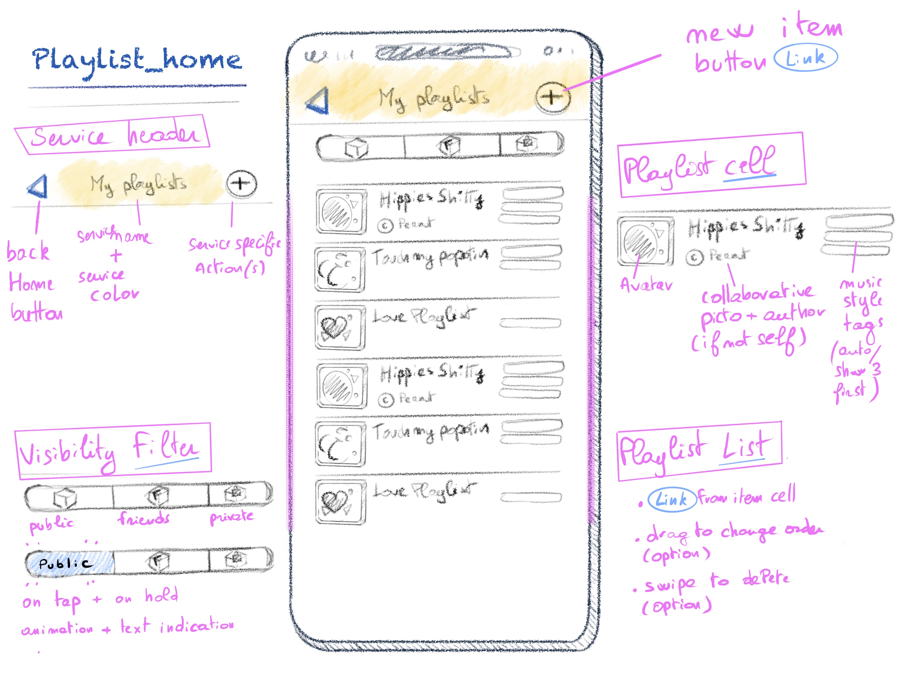
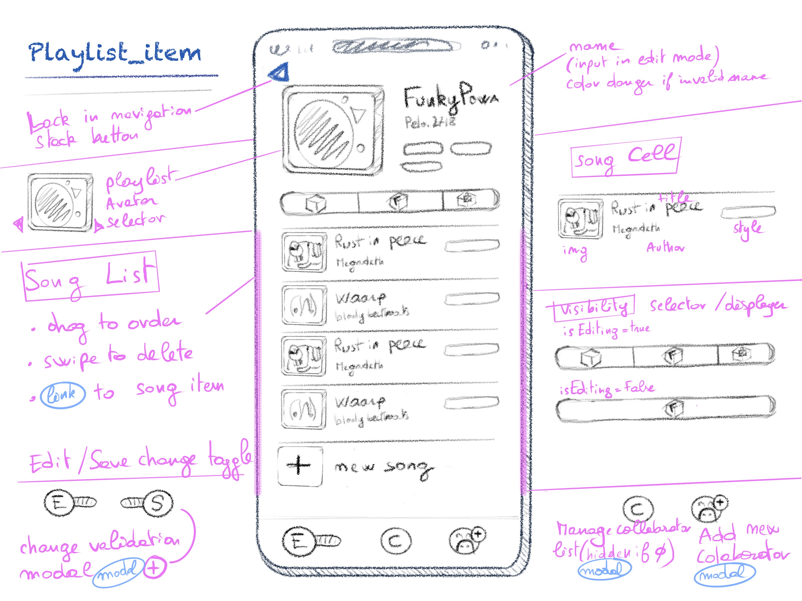
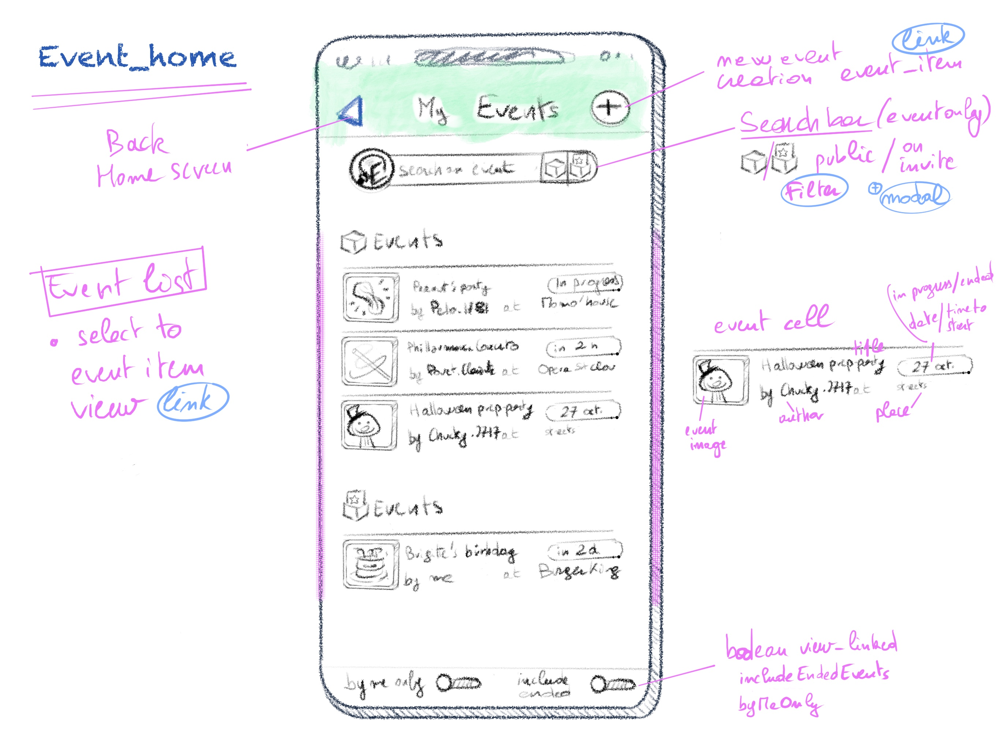
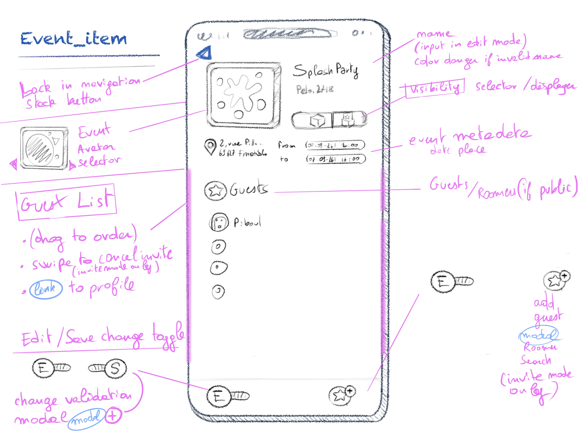

# Screens roughs

[< Back to readme](../README.md)

- [Authentification](#1-authentification-screens)
- [Home](#1-home-screen)
- [Profile service](#2-profile-screens)
- [Playlist service](#3-playlist-service)
- [Event service](#4-event-service)

## 0. Authentification

[<](#screens-roughs)

**LOGIN**  

**REGISTER**  

## 1. Home screen

[<](#screens-roughs)

**HOME *services hub***  

## 2. profile service

[<](#screens-roughs)

**PROFILE** `owner` `no-edit`  

**PROFILE** `owner` `edit`  

**PROFILE** `no-owner`  

## 3. Playlist Service

[<](#screens-roughs)

**PLAYLIST_HOME**  

**PLAYLIST_ITEM**  

## 4. Event Service

[<](#screens-roughs)

**EVENT_HOME**  

**EVENT_ITEM**  

