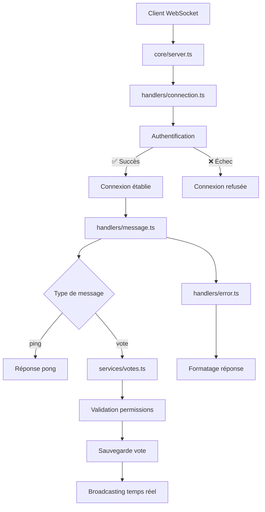

# WebSocket Server Architecture

Ce serveur WebSocket utilise une architecture modulaire pour améliorer la lisibilité et la maintenabilité du code.

## 📁 Structure du projet

```
src/
├── server.ts              # Point d'entrée principal
├── core/
│   ├── server.ts          # Serveur Hono principal
│   └── websocket_manager.ts # Gestion des connexions WebSocket
├── handlers/
│   ├── connection.ts      # Gestion des connexions (auth, open, close)
│   ├── message.ts         # Traitement des messages WebSocket
│   └── error.ts          # Gestion des erreurs et messages
└── services/
    └── votes.ts          # Logique métier des votes
```

## 🧩 Description des modules

### 📄 `src/server.ts`
Point d'entrée principal qui importe et lance le serveur.

### 🖥️ `core/server.ts`
- Serveur Hono principal
- Configuration des routes WebSocket
- Orchestration des handlers
- Initialisation des services

### 🔌 `core/websocket_manager.ts`
- Gestion des connexions WebSocket actives
- Map des utilisateurs connectés
- Utilitaires pour ajouter/supprimer des clients

### 🤝 `handlers/connection.ts`
- **Authentification** : Validation des tokens Supabase
- **Ouverture de connexion** : Setup initial, fermeture des connexions existantes
- **Fermeture de connexion** : Nettoyage des ressources
- **Gestion des erreurs** : Logs et debugging

### 💬 `handlers/message.ts`
- **Routage des messages** : Switch sur les types de messages
- **Validation** : Type guards pour les messages
- **Handlers spécialisés** : Ping/pong, votes, etc.

### ❌ `handlers/error.ts`
- **Messages d'erreur** : Formatage standardisé
- **Messages de succès** : Réponses positives
- **Utilitaires d'envoi** : Helpers pour envoyer des messages

### 🗳️ `services/votes.ts`
- **Logique métier des votes** : Validation, permissions, sauvegarde
- **Realtime** : Abonnement aux changements Supabase
- **Broadcasting** : Diffusion des mises à jour aux clients

## 🔄 Flux de traitement



## 🛠️ Avantages de cette architecture

### ✅ **Séparation des responsabilités**
- Chaque module a un rôle spécifique et bien défini
- Code plus facile à comprendre et maintenir

### ✅ **Réutilisabilité**
- Les handlers peuvent être réutilisés
- Services indépendants et testables

### ✅ **Extensibilité**
- Facile d'ajouter de nouveaux types de messages
- Structure prête pour de nouvelles fonctionnalités

### ✅ **Debugging**
- Logs centralisés par module
- Erreurs tracées facilement

### ✅ **Tests**
- Chaque module peut être testé unitairement
- Mocking simplifié des dépendances

## 🚀 Utilisation

```bash
# Démarrer le serveur
deno run --allow-net --allow-env src/server.ts

# Ou avec les permissions complètes
deno run -A src/server.ts
```

## 📊 Types de messages supportés

### `ping`
```json
{
  "type": "ping"
}
```

### `vote`
```json
{
  "type": "vote",
  "eventId": "uuid",
  "trackId": "spotify_track_id"
}
```

## 🔧 Configuration

Les variables d'environnement requises :
- `SUPABASE_SERVICE_ROLE_KEY` : Clé service role Supabase
- `PORT` : Port d'écoute (défaut: 8080)

## 📈 Monitoring

Le serveur fournit des logs détaillés pour :
- Connexions/déconnexions
- Messages traités
- Erreurs et exceptions
- Broadcasting temps réel
